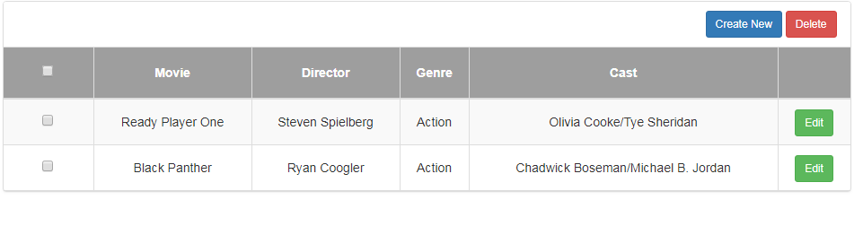
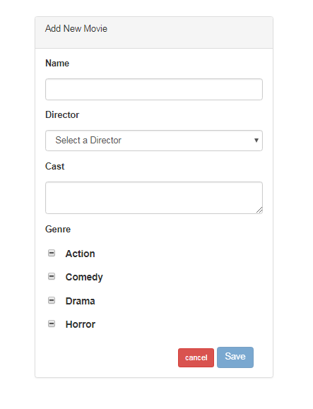
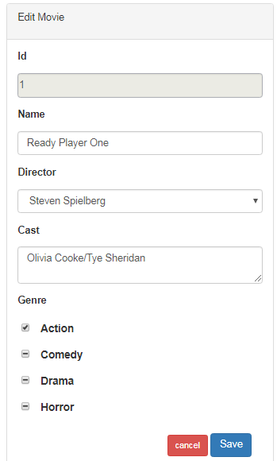

# Web UI Development challenges
This repo has challenges related to Web UI development using UI frameworks like angular.

## Instructions 
Solve any 1 challenge with following checklist of instructions
1. Fork [this](https://github.com/programming-skill-tests/front-end) repo
2. Develop the features shown in the workflow using [angular5](https://angular.io/guide/quickstart) in movie-collection project.
3. Create [unit test](https://angular.io/guide/testing) cases to all the classes.
4. Publish the code coverage report in Readme file (in forked repo).
5. Raise a [Pull request](https://help.github.com/articles/creating-a-pull-request-from-a-fork/) to this repo from forked repo.

### Challenge 1
#### View grid of movies

#### 'Add New', to open movie form.

#### 'Edit Movie', to edit movie.

