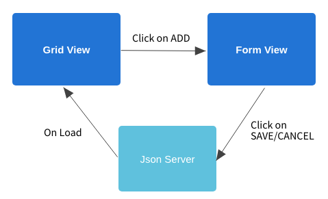

# Web UI Development challenges
This repo has challenges related to Web UI development using UI frameworks like angular.

## Instructions 
Solve any 1 challenge with following checklist of instructions
1. Fork [this](https://github.com/programming-skill-tests/front-end) repo
2. Develop the features shown in the workflow using [angular5](https://angular.io/guide/quickstart)
3. Create [unit test](https://angular.io/guide/testing) cases to all the classes.
4. Publish the code coverage report in Readme file (in forked repo).
5. Raise a [Pull request](https://help.github.com/articles/creating-a-pull-request-from-a-fork/) to this repo from forked repo.

## Pre-requisites
1. Install Node and npm
2. Install [Json Server](https://github.com/typicode/json-server)
3. Install [angular-cli](https://cli.angular.io/)

### Challenge 1
#### View grid of movies

#### Click on 'Add New', to open movie form.

Fill the form and click on 'Save' button. Information is saved and grid view is displayed with latest data. Click on 'Cancel' button to come back to Grid view.

### Work flow

